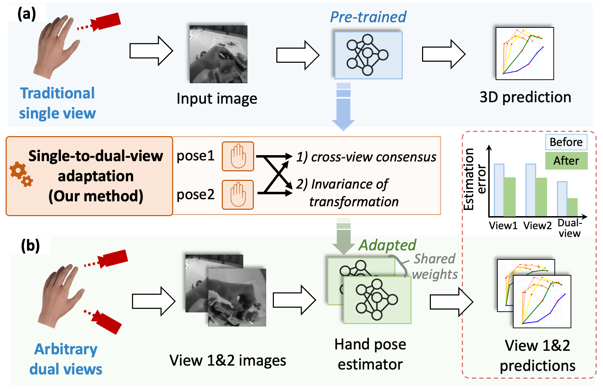
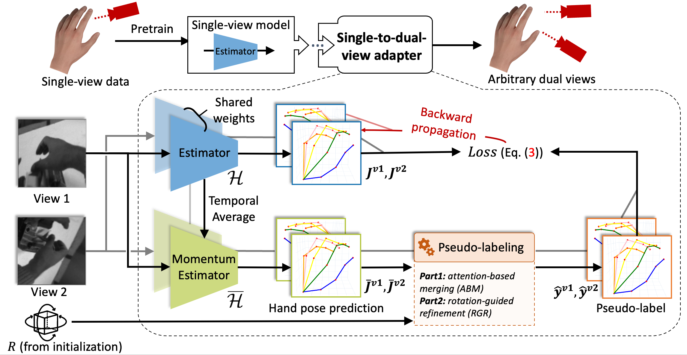

ECCV HANDS2024: AssemblyHands-S2D Challenge
---

This is the baseline method for the **ECCV HANDS2024: Single-to-Dual-View Adaptation Challenge**. 

The "Single-to-Dual-View Adaptation" aims at adapting a pre-trained single-view hand pose estimator to arbitrary dual views, where the dual view's extrinsic parameters are unknown but fixed. Such task is proposed in recent work [Liu et al. Single-to-Dual-View Adaptation for Egocentric 3D Hand Pose Estimation](https://openaccess.thecvf.com/content/CVPR2024/papers/Liu_Single-to-Dual-View_Adaptation_for_Egocentric_3D_Hand_Pose_Estimation_CVPR_2024_paper.pdf).

<div align=center>   </div>

**Picture:**  *Overview of the proposed Single-to-Dual-view framework for adapting a traditional single-view hand pose estimator to arbitrary dual views.*

<div align=center>   </div>

**Picture:**  *The proposed architecture.*

---
## Resources

The dataset and pre-trained models for this challenge is provided:

- AssemblyHands dataset: https://assemblyhands.github.io/
- Pre-trained models: https://drive.google.com/file/d/1qmN7CrvPxxW7Kz35dlfadUn4bF_w6hx6/view?usp=sharing
- Submission code: https://github.com/ut-vision/ECCV2024-AssemblyHands-S2D

## System requirements

* Only Linux is tested.
* 64-bit Python 3.10 installation. 

## Goal of this challenge
Achieving better accuracy on each dual-camera pair of the test set (data folder "test_HANDS2024"). The metric will be accuracy among all 12 dual-camera pairs.

## Playing with pre-trained networks and training

### Data preparation

Please download the pre-trained models and AssemblyHands dataset first. Assuming the pre-trained models and dataset are stored under ${DATA_DIR}. The structure of ${DATA_DIR} follows

```
- ${DATA_DIR}
    - AsseblyHands
        - annotations
            - test_HANDS2024
            - val
        - images   
            - ego_images_rectified
                - test_HANDS2024
                - val  
    - pretrain 
        - ckp_detnet_32.pth
        - ckp_detnet_34.pth
        - ckp_detnet_39.pth
```
Please run the following command to register the pre-trained model and data.
```
cp ${DATA_DIR}/S2DHand-pretrain/* pretrain
mkdir data
mkdir data/assemblyhands
ln -s ${DATA_DIR}/AssemblyHands/* data/assemblyhands
```

Optional: This code will automatically check all invalid data when first run, which takes lots of time. To save time, you can download the pre-generated invalid.txt [here](https://drive.google.com/file/d/1ntSSfovvbUarvBmXDhCrWrNlrTWpVwpb/view?usp=sharing) and move it to `${DATA_DIR}/AssemblyHands/annotations/${split}`. For example, move `invalid_train_ego.txt` to `${DATA_DIR}/AssemblyHands/annotations/train`.  
### Initialization
After downloading the pre-trained weights, run `initialize_R.py` to initialize rotation matrix across all views. The code calculates rotations matrix from predictions of the pre-trained models.

We provide an example in `run.sh`:
```bash
#Initialize rotation matrix
for setup in 0 1
do
  for pair in 0,1 0,2 0,3 1,2 1,3 2,3
  do
    python3 initialize_R.py -eid PRE_MODEL_ID --setup ${setup} --pair ${pair}
  done
done
```

### Single-to-Dual-View Adaptation (Training)

`run.sh` provides a complete procedure of training and testing. The `adapt_detnet_dual.py` automatically tests the adapted model after each epoch of adaptation.

We provide several arguments for adaptation:

`--set` indicates the data set to use, which can be set as `val` or `test`. 

**Because test set annotations are not accessible, evaluation results will be "nan" when setting `--set=test`. But kindly set `--set=test` to generate predictions for the final results on set "test_HANDS2024"**

`-trs` and `-tes`. They represent training and testing dataset, please set it to "ah" (assemblyhands).

`--root_idx` represents the root joint index for alignment. Remember to set it as 0 for in-dataset adaptation.

`--pic` number of image pairs for adaptation or evaluation, set to `--pic=-1` for using all image pairs.

`--checkpoint` directory to save models or load the model for evaluation.

`--resume` remember to add this argument for adaptation from an initial model.

`--evaluate` please use this argument of testing/evaluating an existing model.

`-eid, --evaluate_id` determines which epoch's model is used for adaptation or evaluation. Note that the code will first look for the model in `--checkpoint`.

`--epochs` number of adaptation epochs.

`--start_epoch` start epoch for saving models.

`--setup` can be set as 0 or 1, which stands for the id of the two headsets from AssemblyHands.

`--pair` determines which dual-camera pair is used for adaptation for evaluation. Possible values: `0,1 0,2 0,3 1,2 1,3 2,3`.

`--gpus` gpu id.

For example, run code like:

```bash
python3 adapt_detnet_dual.py -trs ah -tes ah --set val --root_idx 0 --pic 1024 --resume -eid 34 --epochs 10 --start_epoch 1 --gpus 0 --checkpoint in_dataset_adapt --setup 0 --pair 1,2
```

If first running this code, the `pretrain/ckp_detnet_34.pth` model will be adapted to the camera pair `1,2` of headset 0. 1024 images pairs will be used and there are 10 adaptation epochs in total.

### Test

All arguments are the same as training.

Usually, extra testing is not necessary, as it will be automatically done after adaptation. Still, we can run code like:

```bash
python3 adapt_detnet_dual.py -trs ah -tes ah --evaluate -eid 34 --gpus 0 --pic -1 --checkpoint pretrain --setup 0 --pair 1,3
```

This will test the pre-trained weights `pretrain/ckp_detnet_37.pth` on the camera pair `1,3` of headset 0.

Please refer to `run.sh` for a complete procedure from training to testing.
### Submission
We provide code to generate final submission files (json). Run `gen_submit_json.py` after testing on all dual-view pairs. For example:
```bash
python3 gen_submit_json.py --evaluation_dir in_dataset_adapt/evaluation/ah -eid 10 --savepath assemblyhands_test_joint_3d_eccv24_pred.json
```
where the `--evaluation_dir` is the directory to store test logs, `-eid` is the epoch to use, and `--savepath` defines the file path to save the generated json file.

**Please refer to the script `run.sh` for the whole process.**
### Visualization
Run `visualize.py` for visualization. However, cropped assemblyhands images are required. Please refer [here](https://drive.google.com/file/d/14Cx3scq6PqlcvWVnfd3EsH-ML-NbK71E/view?usp=sharing) for our cropped images.

Please run the following command to register the cropped data for visualization.
```
ln -s assemblyhands_crop data
```

Then, run code like:
```bash
python3 visualize.py --checkpoint in_dataset_adapt/evaluation/ah -eid 37 --sample_idx 0 --setup 0 --pair 1,3
```

**Note**: the visualization requires log file, which is generated by testing. Therefore, it is necessary to run testing (e.g., `python3 adapt_detnet_dual.py -trs ah -tes ah --evaluate -eid 37 --gpus 0 --pic -1 --checkpoint pretrain --setup 0 --pair 1,3`) before visualization. You may want to set `--pic` as a small value for a shorter testing time.

The `--sample_idx` indicates the index of sample for visualization. If it goes well, we can see the predictions and ground-truth labels on the images pair we choose.

## Citation

If this work or code is helpful in your research, please cite:

```latex
@inproceedings{liu2024single,
 title = {Single-to-Dual-View Adaptation for Egocentric 3D Hand Pose Estimation},
 author = {Liu, Ruicong and Ohkawa, Takehiko and Zhang, Mingfang and Sato, Yoichi},
 booktitle = {Proceedings of the IEEE/CVF Conference on Computer Vision and Pattern Recognition},
 pages = {0--0},
 year = {2024}
}
```
If you are using the detnet network in this project, please also cite its original paper:

```latex
@inproceedings{zhou2020monocular,
  title={Monocular real-time hand shape and motion capture using multi-modal data},
  author={Zhou, Yuxiao and Habermann, Marc and Xu, Weipeng and Habibie, Ikhsanul and Theobalt, Christian and Xu, Feng},
  booktitle={Proceedings of the IEEE/CVF Conference on Computer Vision and Pattern Recognition},
  pages={5346--5355},
  year={2020}
}
```
This project is built on an unofficial PyTorch reimplementation of `Zhou et al. Monocular real-time hand shape and motion capture using multi-modal data. CVPR2020`. Original project page: https://github.com/MengHao666/Minimal-Hand-pytorch.

## Contact

For any questions, including algorithms and datasets, feel free to contact me by email: `lruicong(at)iis.u-tokyo.ac.jp`
